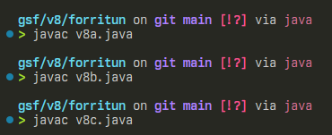
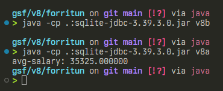
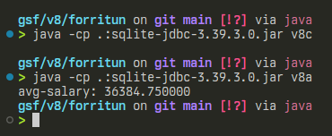
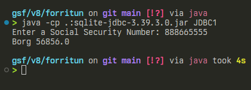

# gagnasafnsfræði - vikublað 8 

> öll þessara falla notast við samskonar "boilerplate" kóða sem ég set neðst í þessi skil

## 1.
[forritið](./forritun/v8a.java)

```java
double salaries = 0;
int cnt = 0;
ResultSet rs = statement.executeQuery("select Salary from EMPLOYEE");
// keyrir fyrir allar launatölur í EMPLOYEE
while (rs.next()) {
    // bætir gildi við salaries og einum við teljara
    salaries += rs.getDouble(1);
    cnt++;
}
rs.close();
// prentar út meðaltal launatalna
System.out.printf("avg-salary: %f", salaries/cnt);
```

## 2.
[forritið](./forritun/v8b.java)

```java
// query strengur skilgreindur
String query = "update EMPLOYEE set Salary = (Salary + 200) where Ssn = ?";
PreparedStatement p = connection.prepareStatement(query);

// keyrir fyrir hverja kennitölu í EMPLOYEE
ResultSet rs = statement.executeQuery("select ssn from EMPLOYEE");
while (rs.next()) {
    // nær í einstaka kennitölur
    String ssn = rs.getString(1);
    // hreinsar p til að geta sett inn ferskt viðfang
    p.clearParameters();
    // setur kennitölu sem viðfang í p
    p.setString(1, ssn);
    // keyrir p
    p.execute();
}
rs.close();
```

## 3.
[forritið](./forritun/v8c.java)

```java
// fyrir allt starfsfólk í EMPLOYEE setja Salary sem Salary*1.03
statement.executeUpdate("update EMPLOYEE set Salary = (Salary*1.03)");
```

<div style='page-break-after: always;'></div>

## 4.


### keyrsla á JDBC1 fyrir breytingar


### þýða öll forritin
  

### keyrsla á v8a
  

### keyrsla á v8b, síðan v8a til að sýna meðallaun
  

### keyrla á v8c, síðan v8a til að sýna meðallaun


### keyrsla á JDBC1 eftir breytingar


<div style='page-break-after: always;'></div>

## boilerplate

```java
import java.sql.*;

public class v8abc {
    public static void main(String[] args) throws ClassNotFoundException {
        Class.forName("org.sqlite.JDBC");
        Connection connection = null;
        try {
            connection = DriverManager.getConnection("jdbc:sqlite:company.db");
            Statement statement = connection.createStatement();

            // ~~~~~~~~~~~~~~~~~~~~~~~~~~~~~~
            // VERKEFNAKÓÐI KEMUR HÉR Á MILLI        
            // ~~~~~~~~~~~~~~~~~~~~~~~~~~~~~~

        } catch (SQLException e) {
            System.err.println(e.getMessage());
        } finally {
            try {
                if (connection != null)
                    connection.close();
            } catch (SQLException e) {
                System.err.println(e);
            }
        }
    }
}
```